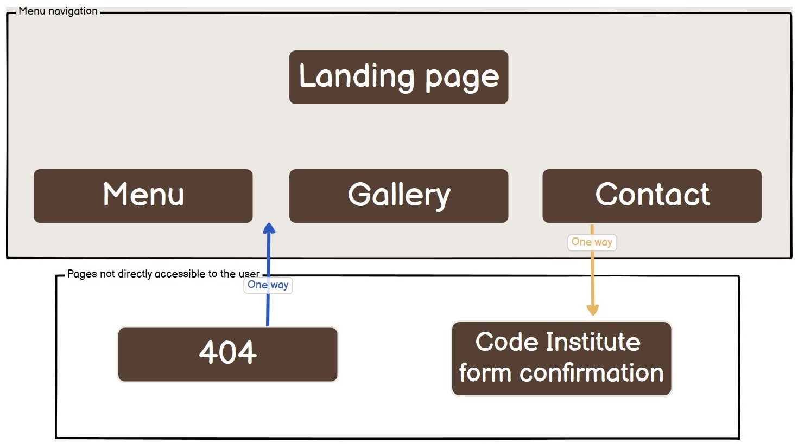
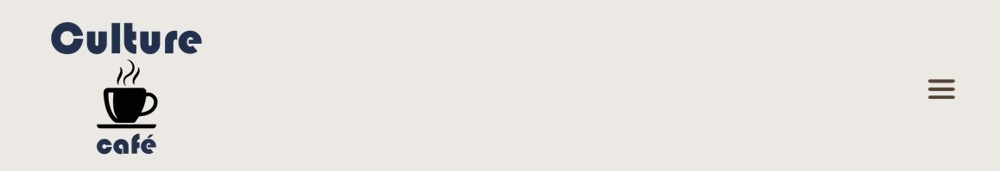
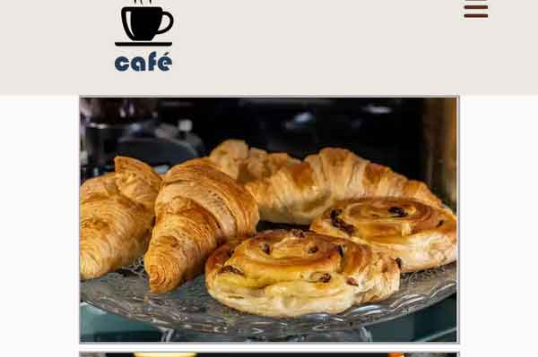
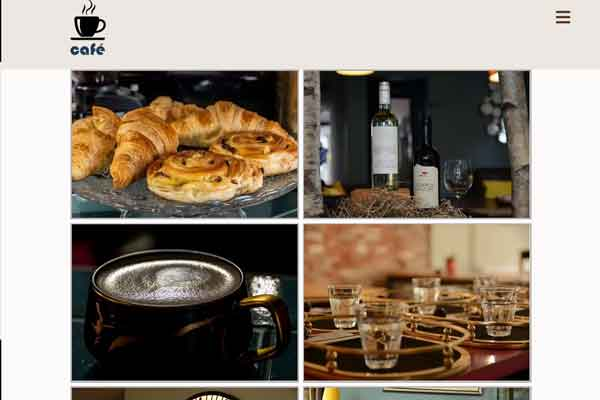
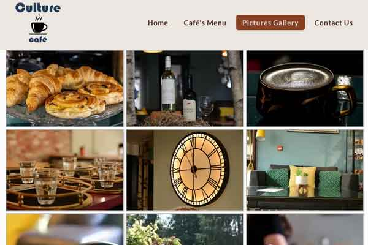
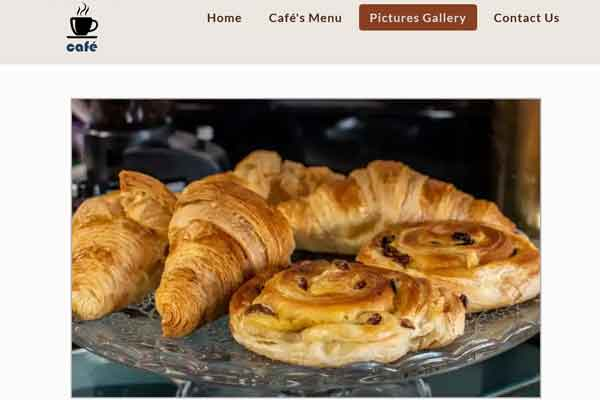
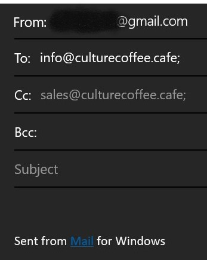

    

# **Table of Contents**
1. [**About the site**](#about-the-site)
    * [**Link to live website**](#link-to-live-website-is-here)
    * [**Link to GitHub repository**](#link-to-github-repo-is-here)
1. [**UX (User Experience)**](#ux-user-experience)
    * [**User Stories**](#user-stories)
    * [**The Strategy and the Scope Plane**](#the-strategy-and-the-scope-plane**)
    * [**The Structure Plane**](#the-structure-plane)
        *  [**Accessibility**](#accessibility)
1. [**UI (User Interface)**](#ui-user-interface)
    *  [**Wireframes**](readme-files/docs/wireframes.md)
    *  [**Site structure**](#site-structure)
    *  [**Layout**](#layout)
        * [Header](#header)
        * [Main content](#main-content-section)
            * [Home page](#home-page)
            * [Menu page](#menu-page)
            * [Gallery page](#gallery-page)
            * [Contact page](#contact-page)
        * [Footer area](#footer)
    *  [***Text***](#text)
    *  [***Colour theme***](#colours)
    *  [**Accessibility**](#accessibility)
        *  [**Contrast ratio**](#contrast-ratio)
    *  [**Responsiveness**](#responsiveness)
1. [**Performance**](#performance)
1. [**Testing**](readme-files/docs/testing.md)
1. [**Issues**](#issues)
1. [**Deployment**](readme-files/docs/deployment.md)
1. [**CREDITS:**](#credits)
    *  [**Code Snipets:**](#code-snipets)
    *  [**Research and Information:**](#research-and-information)
    *  [**Media**](#media)
    *  [**Other Resoruces:**](#other-resources)

  ---
# **About the site** 
***Culture Coffee cafe*** is a static website which is intended to promote, atract and offer information to potential and actual customers of Culture Coffee café. 
Since this website was build as a Milesstone Project for my course, therefore educational purposes only, please be advised that some information on the website may not accurate and are displayed for the fore-mentioned scope.
### Link to live website is [here](https://phloreenm.github.io/MP1-CultureCoffee-CI-CoBC-FM/)
### Link to this GitHub repo is [here](https://github.com/phloreenm/MP1-CultureCoffee-CI-CoBC-FM/tree/main)  

Some sections of this documentation have been moved to a different file, specific to that content.
The reason is all that information in this docuement only woud've made navigation difficult. So for example, `wireframes.md`, `contrast.md` or `testing.md`, are different files and they are linked in this document.
Inside those separate files there are links back to the main readme.md file too.

[Back to Table of Contents](#table-of-contents)

---
# **UX (User Experience)**

## **User Stories**
I decided to display the User Story in a table (also a link at the bottom of the table). Since some user stories (like First time user and Existing User) might have common stories, 

| As a/an             | I want to...      | So that I can... | Scenario 1 | Scenario 2 | Acceptance Criteria |
|---------------------|-------------------|------------------|------------|------------|---------------------|
| **First time user** | **Existing User** | **Bussiness**    |            |            |                     |
| &#10003;            | &#10003;          |                  | find café's location                                 | drink a coffee in the café                            | Decided to visit the shop                                                         |                                                                                                   |                                                                                                                                                    |
| &#10003;            | &#10003;          |                  | find opening hours                                   | make avisit to the café                               |                                                                                   |                                                                                                   |                                                                                                                                                    |
| &#10003;            |                   |                  | see café's inside pictures                           | decide if I like the location                         | user is well impressed by the very positive reviews and decides to visit the café | User read some negative reviews and developed uncertainity if quality offered is high as promised |                                                                                                                                                    |
| &#10003;            | &#10003;          |                  | find if pets are allowed                             | bring my pet at the cafe                              |                                                                                   |                                                                                                   | (Only) Disabled people that use assistance dogs have important rights under the Equality Act 2010 - hygiene maters, so other cases can be accepted |
| &#10003;            |                   |                  | read some testimonials (reviews)                     | see other clients' experience                         |                                                                                   |                                                                                                   |                                                                                                                                                    |
| &#10003;            | &#10003;          |                  | find if the café offers takeaway                     | buy a coffee on my way to the train                   |                                                                                   |                                                                                                   |                                                                                                                                                    |
| &#10003;            | &#10003;          |                  | stay outside                                         | enjoy the sun while having a coffee                   |                                                                                   |                                                                                                   | weather is good                                                                                                                                    |
| &#10003;            | &#10003;          |                  | see if power outlets and internet acces are provided | use my laptop and have a coffee                       |                                                                                   |                                                                                                   |                                                                                                                                                    |
| &#10003;            | &#10003;          |                  | see if they offer wheelschair acces                  | bring someone confined to a wheelchair                |                                                                                   |                                                                                                   |
|                     |                   | &#10003;         | sell my products                                     | make profit                                           |                                                                                   |                                                                                                   |
|                     |                   | &#10003;         | create a select clientele                            | make a target                                         |                                                                                   |                                                                                                   |
|                     |                   | &#10003;         | reward the loyal clients                             | retain customers                                      | Using loyalty cards - 10th coffee comes from the house                            |                                                                                                   |
|                     |                   | &#10003;         | update Social Media                                  | make a presence in the online                         |                                                                                   |                                                                                                   |
|                     |                   | &#10003;         | offer a good, intuitive browsing experience          | raise the chances the client would remain on the site |                                                                                   |                                                                                                   |
|                     |                   | &#10003;         | implement a good site structured layout              | provide concise  informations                         |                                                                                   |                                                                                                   |
|                     |                   | &#10003;         | provide pictures gallery                             | showcase some of the products on sale                 |                                                                                   |                                                                                                   |
|                     |                   | &#10003;         | provide pictures gallery                             | present the premise's interior design                 |                                                                                   |                                                                                                   |

An online Excel version of the User Stories Board can be found [here](https://1drv.ms/x/s!AhVZRr1-0ZpXmKwYxEhkrC46UlGAow?e=utUtgc)

[Back to Table of Contents](#table-of-contents)

---

# **UI (User Interface)**
The wireframe sketches are located in [wireframes.md](readme-files/docs/wireframes.md) file.
<!-- ### **Wireframes** -->
## **Site structure**
The site's structure follows a simple linear design. From the home page you may access any other page through the navigation menu. This is a straight forward aproach. The same navigation menu is accesible on every other page, even on the [404.html](404.html) one. But not on the Code Institute page, which confirms the fors has been successfuly submited.
One reason behing this aproach is the idea behind the [Mental Model](https://en.wikipedia.org/wiki/Mental_model) natural thought process, more exactly, the users build mental models and use these 
>"to assess relations among topics and to guess where to find things they haven’t seen before".[ (Site Structure theory)](https://webstyleguide.com/wsg3/3-information-architecture/3-site-structure.html)

The following diagram represents this structure:

[Back to Table of Contents](#table-of-contents)

## **Layout**
The general layout of the website is composed of three main areas: Header, Content and Footer. 
### **HEADER** 
- contains the company's logo and, depending on the device's screen width, a menu navigation bar to the top right (on larger screens) or a hamburger menu button (which opens the hidden menu - in mobile view).
    On screens up to 920px width:
    
    On screens larger than 920px width:
    
### **MAIN CONTENT SECTION**
- contains the page's specific subjects (like information, cafes menu, pictures gallery, contact form or the 404 page).
- this area is limited to a `max-width: 1000px;` there is also a `padding: 0 100px;` in desktop view. Also the background-color is limited to this width and this should create a delimitation between the empty space and the actual main content.
- in mobile view the pading is reduced to `30px` and the `width:100%`, so more information would fit on smaller screens.

#### **Home page**
Home page main section contains:
- a welcoming message at the top.
- some introductory information structured as Q&A form. Some sections (like menu lists) of the site are linked in the content of this area, making navigation handy. 
The purpose is to guide the visitor through the website's content, and describe what the company has to offer.
- Top of the page in mobile view:

-  
- Bottom of the page in mobile view:

-  

#### **Menu page**
The menu page is structured differently that the other pages, because the main purpose is to display the cafe's menu, sorted by categories. For that reason I found useful to use the grid system. The same result could be obtained with just using flexbox too, but my choice was grid for this page.
- In mobile views the layout is formed on a column pattern. So the categories and their content are all displayed in columns.
- In desktop view the center layout is displayed in a column: the categories in this column and the the content as two items on a row.
- Acros the content of the page there is a link `Back to top`(... of the page), to help the user to jump to the main navigation bar area.
- I chose to create another menu specific to this page only.
    - This menu only contains internal links on the same page, to the main categories from the list, which are: Coffees, Dishes, Cakes and Wines. 
    - Using this menu the navigation is quicker for the user, if he's interested in a specific product and is not interested to see other items. 
    - It is available at the bottom of the page too.
    - Since using JS is not required for this project, I needed to find a way to change the text of a specific area, when the state changes. I found out that the `
` element can help.
    So when this menu is collapsed, the user is asked to acces this menu by clicking the `▶️  Click to open quick menu links`:
    
    After the user clicks, the menu opens like this:
    
    The user may choose to colapse the menu by clicking again `🔽 Click to close quick menu links` area.
    You may notice that the text content changes from "open" to "close". The ▶️ and 🔽 icons display the status of the `
` element.
    - In mobile and desktop view, this area keeps the same layout, by adapting its width to the viewport.
    

#### **Gallery page**
The Gallery page has only one purpose: to showoff some pictures depincting the interior design of the cafe, staff, making coffees, etc.
- In mobile view there are two views: when width is under 673px, the images are displayed on a single column:

- When the width is between 673 and 981px, the are two columns:

- Between 982px and 992px the are three columns. This is because of the default sizes of each image for this view:

- Over 992px is the desktop view and the images are displayed on a single column, at high resolution:

#### **Contact page**
The contact page is structured around a form, containing multiple fields, which the user may choose to fill. The user can make a request, ask a question, propose a recommandation, make a complain and also take part to a poll by votting his favorite coffee.

  
  

### **FOOTER**
- has three sub-areas, as follows:
    - ADDRESS - has a link with the Google Maps location of the Cafe shop. Accessing the link will offer you the posibility to ask for directions towards the shop. Depending on the device used, the behaviour differs: on mobile deviced it will open the Google Maps app and on desktop device it will open a new page with Google Maps.
    - SOCIAL MEDIA LINK - linked icons to acces the social media pages of the cafe shop. On hover over these icons, they grow in size by `2rem`.
    - CONTACT US:
        - The EMAIL has the `mailto:` link, so if the user want's, by pressing on the e-mail address, the default email client is opened. The `Send to` and `CC` section are prefilled with the right email destinators addresses.

        
        - the TEL is also a link, which, while in mobile view, is enabled and proceeds to opening the phone number in calling screen, but if viewed on a desktop, the link is disabled. As described [here](https://www.campaignmonitor.com/blog/email-marketing/using-phone-numbers-in-html-email/):  
        > *tel: support is great across mobile clients, it can be unreliable on the desktop and in webmail clients.*

[Back to Table of Contents](#table-of-contents)

## **Text**
- Fonts used:
    - General Headings: Proza Libre — Regular 400 (to stand out)
    - Menu items heading: Lato - 3,4,7,9
    - Paragraphs: 
        Montserrat (good readability - designed for optimal readability on screens) 
        Font families groups:
        font-family: 'Proza Libre', sans-serif;
        font-family: 'Lato', sans-serif;
        font-family: 'Montserrat', sans-serif;
        font-family: 'Merriweather', serif;
            
[Back to Table of Contents](#table-of-contents)

## **Colours**
Choosing the site's color theme was a bit tricky for me.

I have a *Moderate Deutan colour blindness*. This doesn't affect me in a manner where I could not see colours, as many people might believe when they hear "colour blindness". But it more related to colour sensivity. Is just that in some specific cases (low or crepuscular light, for example) I might not perceive colours as others. For this reason I needed help from someone else, so in some moments in the development of this project I had to ask for a second opinion.

Finally, the color theme I decided to use in this project is actually is based on the color of a coffee bean. So I primarly used an image of coffee beans. From that, using the tools available at [coolors.co](https://coolors.co/) I extracted the main pallete colors.
The extracted color nuances were too many, so I had to finnaly decide to which basic color I'll use. 
After, to create an acceptable contrast, I've used the generator so that I'll will give me colors to fit one each other.
As a result the final contrast ratio is everywhere above 9:1. All contrast test were conducted on [Color Contrast Accessibility Validator](https://color.a11y.com/Contrast/) and [WebAIM - Contrast Checker](https://webaim.org/resources/contrastchecker/). The result can be consulted in the [dedicated file](assets/docs/contrast.md).

Basic color theme:
navigation menu bg: #ece7e1
Nav menu button: #552f1e
Nav menu links text: #F5F7BB
Nav menu links bg: #552f1e
Nav menu links bg active: #883f22 - a washed out version of the 

Top page link bg hover: #552f1e
Top page link text hover: #552f1e

Links default text color: #231a19
Menu mavigation link hover: #231a19

footer background: #552f1e
footer text color: #ece7e1
footer hover link: #f6b565

Special color:
Main content Darken Blending color: variation of #883F22 in RGBA format.
Nav menu links bg active: #883f22 - a washed out version of the 
card bottom separator: #ccc

---
# **Accessibility**

- In mobile view the main navigation bar is hidden behind an icon. The icon has normally applied a bouncing effect, but to avoid vestibular motion triggers the animation is reduced (in media queries section of the css file), when the user has disabled such effects.

- Mark up different regions of web pages and applications, so that they can be identified by web browsers and assistive technologies.

## **Contrast**
To test the contrast of the page, I've used [Color Contrast Accessibility Validator](https://color.a11y.com/Contrast). I've inserted links from live website and then I downloaded the reports.

- Navigation Bar

[Back to Table of Contents](#table-of-contents)

---

# **Responsiveness**

- Some commonly used breakpoints are 576px, 768px, and 992px. These values should cover most of the targetted devices, like smart phones, tablets/laptops, and desktops. 

For responsiveness on mobile devices the minimum supported width is 300px. Using smaller resolution would make the pictures unreasonbly undistinguisable. That's why I decided this would be the minimum body's width.
Going higher in the width resolution from 768px to 991 we see a mobile view adapted for tablets or some laptop screens, with larger paddings and margins, but keeping the text slightly smaller than in full desktop view.

Going over 992px in width the layout adapts to a full desktop view, with a maximum width of the main content.

The navigation bar has a little different responsivness than the rest of the layout because of the size of the text from navigation bar, and also because I din not want navigation's items to wrap in desktop or tablet view mode.
Therefore the transformation of the navgation bar from desktop view to mobile view happens much earlier, going down from 920px.

===========================================

[Back to Table of Contents](#table-of-contents)

---
# **Deployment:**
[Deployment PAGE](/readme-files/docs/deployment.md)

[Back to Table of Contents](#table-of-contents)

---
# **CREDITS:**

## **Code Snipets:**
- [Header layout and effects](https://www.codinglabweb.com/2020/12/responsive-navigation-card-bar-design.html)
- [Content flexbox cards code](https://www.youtube.com/watch?v=cJjej5udWVE)
- [Customize the details element containing the internal links to menu categories](https://stackoverflow.com/questions/10813581/can-i-replace-the-expand-icon-of-the-details-element)
- [HR element styling](https://www.formget.com/css-hr/)
- [Cafe Menu Quick Menu links with details & summary elements](https://stackoverflow.com/questions/10813581/can-i-replace-the-expand-icon-of-the-details-element)

## **Research and Information:** 
- Coffee Types [List](https://www.baristainstitute.com/blog/emmi-kinnunen/january-2022/affogato-ristretto-list-most-common-coffee-drinks)
- Things All Restaurant Website Designs Need to [Include](https://pos.toasttab.com/blog/on-the-line/7-things-restaurant-websites-need-to-include): as highlithed in this article, having some specific sections on your restaurand (cafe in our case), improves a lot the customer experience and the chances of attracting new customers raises.
- Initiating [Voice Calls from HTML Email Newsletters](https://www.campaignmonitor.com/blog/email-marketing/using-phone-numbers-in-html-email/) 
- Tone down the animation to avoid [vestibular motion triggers like scaling or panning large objects.](https://developer.mozilla.org/en-US/docs/Web/CSS/@media/prefers-reduced-motion)

## **Media:**
- Logo was created using [Logo Maker Pro on Android](https://play.google.com/store/apps/details?id=com.TTT.logomaker.logocreator.generator.designer)
- Images used for Cafe Menu product list are all credited in the code, but also in this list:
     - Coffees:
        - [Affogato](https://www.pexels.com/ro-ro/@rachel-claire/)
        - [Espresso](https://www.pexels.com/ro-ro/@victorfreitas/)
        - [Caffè Latte](https://www.pexels.com/ro-ro/@chevanon/)
        - [Caffè Mocha (Mocaccino)](https://www.pexels.com/ro-ro/@content-pixie-1405717/)
        - [Café au Lait](https://www.nespresso.com/ncp/res/uploads/recipes/nespresso-recipes-Cafe-Au-Lait-OL.jpg)
        - [Cappuccino](https://www.pexels.com/ro-ro/@jayoke/)
        - [Cold Brew Coffee](https://www.pexels.com/ro-ro/@marta-dzedyshko-1042863/)
        - [Espresso con Panna](https://i2.wp.com/www.teacoffeecup.com/wp-content/uploads/2020/08/classic-espresso-con-panna.jpg)
        - [Espresso Macchiato](https://www.nespresso.com/ncp/res/uploads/recipes/nespresso-recipes-Five-o-clock-break.png)
        - [Greek Frappé](https://www.pexels.com/ro-ro/@freestocks/)
        - [Freakshake](https://www.pexels.com/ro-ro/@alleksana/)
    - Dishes
        - [Sautéed tiger prawns](https://www.youtube.com/watch?v=FJbhplyVBUE)
        - [Vine tomato salad](https://pixabay.com/photos/vegetables-vegetable-pan-grilling-1620561/)
        - [Scottish mussels](https://www.scottishshellfish.co.uk/scottishmusselscookedinwhitebeer/)
        - [Delicious quiches](https://www.pexels.com/ro-ro/@shkrabaanthony/)
    - Cakes
        - [Caramel apple pie](https://www.pexels.com/ro-ro/@polina-tankilevitch/)
        - [Vegan cheesecake](https://www.pexels.com/ro-ro/@alesiakozik/)
        - [Strawberry gâteau](https://www.pexels.com/ro-ro/@suzyhazelwood/)
        - [Belgian Waffles](https://www.pexels.com/ro-ro/@monica-turlui-36421873/)
    - Wines:
        - [Red Dry Agiorgitiko 2017](https://www.cellartracker.com/wine.asp?iWine=3660056)
        - [Monograph Rose Agiorgitiko 2016](https://gaiawines.gr/en/monograph-rose-en/)
        - [La Gioiosa Prosecco 2012](https://www.vivino.com/HK/en/la-gioiosa-valdobbiadene-prosecco-superiore/w/1148479)
        - [Prunus Dão Tinto 2017](https://www.wine-searcher.com/find/gota+prvt+select+prunus+blanco+dao+portugal/2017/uk)
- Images used in Gallery page are my own, made with my dSLR.

## **Other resources and tools used:**
- Code Validation:
    - [W2C Markup Validation Service](https://validator.w3.org/nu/)
    - [W2C CSS Validation Service](https://jigsaw.w3.org/css-validator/)
- [GitHub Flavored Markdown Spec](https://github.github.com/gfm/)
- [Site structuring](https://webstyleguide.com/wsg3/3-information-architecture/3-site-structure.html)
- [Mental model](https://en.wikipedia.org/wiki/Mental_model)
- Tools:
    - [Balsamiq - wireframes design](https://balsamiq.com/)
    - [Multi Device Website Mockup Generator](https://techsini.com/multi-mockup/)
    - [Adobe Photoshop v.23](https://www.adobe.com/uk/products/photoshop/)
    - [FontAwesome](https://fontawesome.com/)
    - [Google Fonts](https://fonts.google.com/)

[Back to Table of Contents](#table-of-contents)

---
# **Accessibility**
- [Accessibility](): 
- [Landmarks](https://accessibility.blog.gov.uk/2016/05/27/using-navigation-landmarks/)Internet Explorer 11, which does not have accessibility support for the HTML5 elements used to provide landmarks, but which does support the equivalent ARIA roles. 
[enhancing-aria-landmarks-with-aria-labelledby](https://tink.uk/enhancing-aria-landmarks-with-aria-labelledby/)

## **Contrast ratio**
This testing and conclusions are documented in the following file:
[**contrast.md**](readme-files/docs/contrast.md)

[Back to Table of Contents](#table-of-contents)

---
# **Performance**
1. To improve loading speed, I used *.webp image format  (https://developers.google.com/speed/webp)
2. Images were resized to 768px for the long side. This resolution is enough to display good images for breakpoint-md: 768px. On large screens the gallery is presented as a grid of images, but as the width of the screen is lowered, the grid adapts to 2 or 1 column images.

[Back to Table of Contents](#table-of-contents)

---
# **Issues**
Along the development I encountered different issues. Some of them were fixed, for other I found a way around of just used a better solution.
- When resizing the browser window to mobile view, at the left of the browser can be seen the hidden navigation bar transition effect.
- [Contact Page legend text centering](): an issue I had was centering the legend element, which wasn't easy achievable through css, because of the cross browsers incompatibility. There an in-line property solved it (https://www.geeksforgeeks.org/html-legend-align-attribute/). Issues discussed [HERE](https://stackoverflow.com/questions/4006824/how-to-center-the-legend-element-what-to-use-instead-of-aligncenter-attribu)
- I could not find a FontAwesome icon for Tripadvisor. Issue is discussed [HERE](https://github.com/FortAwesome/Font-Awesome/issues/18180)
- While site was deployed on github Pages, the images on the site wouldn't load. Found out that I have to remove the '/' from the relative links. Example:
`<src="/assets/imgs/coffees/image.jpeg>` -> in this format the images wouldn't load, so I had to remove the backslash before the 'assets' folder. Found this through the Developer's Tools in Chrome. In VS Code having the `/` won't affect loading, but on GitHub alt-text is being shown.
- I couldn't use Extended Syntax for Markdown documents, as while I was trying to use Footnotes, for example, it wasn't rendered in my GitHub repository. Therefore I had to use links inside the content to credit the extracted ideas from the respective sources.
- To size images I had to use HTML.
- Wasn't able to use emoji in this document.
- Hover effects won't work properly on touch mobile devices (which are using a touch screen), so a media query for that has to be implemented.
- The navigation menu, while in mobile view, is displayed OVER the content of the page. So opening the menu in mobile view, the actual content below the header won't go lower to make place for the menu items. I didn't want to use JS and/or Boostrap, so this was an acceptable compromise I had to accept for the purpose of this project.
- While [validating](https://validator.w3.org) I had an error 
    > End tag nav seen, but there were open elements.

    > Unclosed element ul.

    but couldn't find any opened or unclosed elements. These errors dissapeared after I corrected the other errors.

[Back to Table of Contents](#table-of-contents)

---
# **Aknowledgment**
I will not end this project without saying a big "thank you!" to all of you who helped me in working on this project.
Firstly to my family who supported me all along in every aspect, especialy in being absent at some important moments.
Of course, nothing would have been possible without everyting Code Institue has to offer through this course and its slack community. 
Since I am officialy taking this course at City of Bristol College, a big thanks to my tutors, [Pasquale F.](https://www.linkedin.com/in/pasquale-fasulo-68612218a/) and Ben S. for every step they've been with me through the learning process.
And last but not least, to my mentor, [Adegbenga Adeye](https://github.com/deye9), whose insights were always very helpful and helped me shape this project.

 

    <a href="#table-of-contents">Return to Table of Contents</a>

 