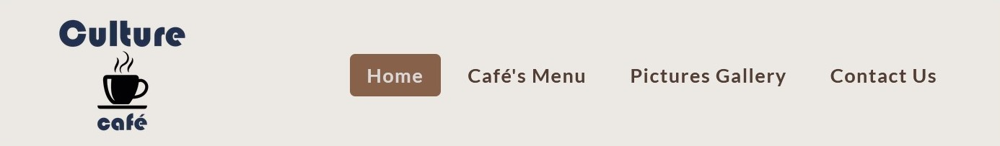

    

    
    

    

    <h1 style="color:#ECE7E1; background-color:#552F1E; font-weight:700; text-align:center;padding:1em;border:1px solid transparent; border-radius:10px;">Culture Coffee café - Milestone Project 1</h1>
    

---
# **Table of Contents**
1. [**About the site**](#about-the-site)
    * [**Link to live website**](#link-to-live-website-is-here)
    * [**Link to GitHub repository**](#link-to-github-repo-is-here)
1. [**Table of Contents**](#table-of-contents)
1. [**UX (User Experience)**](#ux-user-experience)
    * [**User Stories**](#user-stories)
    * [**The Strategy and the Scope Plane**](#the-strategy-and-the-scope-plane**)
    * [**The Structure Plane**](#the-structure-plane)
        *  [**Accessibility**](#accessibility)
1. [**UI (User Interface)**](#ui-user-interface)
    *  [**Wireframes**](assets/docs/wireframes.md)
    *  [**Site structure**](#site-structure)
    *  [**Layout**](#layout)
        * [Header](#header)
        * [Main content](#main-content-section)
            * [Home page](#home-page)
            * [Menu page](#menu-page)
            * [Gallery page](#gallery-page)
            * [Contact page](#contact-page)
        * [Footer area](#footer)
    *  [***Text***](#-text-)
    *  [***Colour theme***](#colours)
    *  [**Accessibility**](#accessibility)
        *  [**Contrast ratio**](#contrast-ratio)
    *  [**Responsiveness**](#responsiveness)
1. [**Performance**](#performance)
1. [**Testing**](assets/docs/testing.md)
1. [**Issues**](#issues)
1. [**Deployment**](assets/docs/deployment.md)
1. [**CREDITS:**](#credits)
    *  [**Code Snipets:**](#code-snipets)
    *  [**Research and Information:**](#research-and-information)
<!-- 1.  [**Improve Customer services**](#improve-customer-services) -->  
  ---
# **About the site** 
***Culture Coffee cafe*** is a static website which is intended to promote, atract and offer information to potential and actual customers of Culture Coffee café. 
Since this website was build as a Milesstone Project for my course, therefore educational purposes only, please be advised that some information on the website may not accurate and are displayed for the fore-mentioned scope.
### Link to live website is [here](https://phloreenm.github.io/MP1-CultureCoffee-CI-CoBC-FM/)
### Link to GitHub repo is [here](https://github.com/phloreenm/MP1-CultureCoffee-CI-CoBC-FM/tree/main)  
[Back to Table of Contents](#table-of-contents)

---
# **UX (User Experience)**

## **User Stories**
I decided to display the User Story in a table (also a link at the bottom of the table). Since some user stories (like First time user and Existing User) might actually follow the same 

| As a/an             | I want to...      | So that I can... | Scenario 1 | Scenario 2 | Acceptance Criteria |
|---------------------|-------------------|------------------|------------|------------|---------------------|
| **First time user** | **Existing User** | **Bussiness**    |            |            |                     |
| &#10003;            | &#10003;          |                  | find café's location                                 | drink a coffee in the café                            | Decided to visit the shop                                                         |                                                                                                   |                                                                                                                                                    |
| &#10003;            | &#10003;          |                  | find opening hours                                   | make avisit to the café                               |                                                                                   |                                                                                                   |                                                                                                                                                    |
| &#10003;            |                   |                  | see café's inside pictures                           | decide if I like the location                         | user is well impressed by the very positive reviews and decides to visit the café | User read some negative reviews and developed uncertainity if quality offered is high as promised |                                                                                                                                                    |
| &#10003;            | &#10003;          |                  | find if pets are allowed                             | bring my pet at the cafe                              |                                                                                   |                                                                                                   | (Only) Disabled people that use assistance dogs have important rights under the Equality Act 2010 - hygiene maters, so other cases can be accepted |
| &#10003;            |                   |                  | read some testimonials (reviews)                     | see other clients' experience                         |                                                                                   |                                                                                                   |                                                                                                                                                    |
| &#10003;            | &#10003;          |                  | find if the café offers takeaway                     | buy a coffee on my way to the train                   |                                                                                   |                                                                                                   |                                                                                                                                                    |
| &#10003;            | &#10003;          |                  | stay outside                                         | enjoy the sun while having a coffee                   |                                                                                   |                                                                                                   | weather is good                                                                                                                                    |
| &#10003;            | &#10003;          |                  | see if power outlets and internet acces are provided | use my laptop and have a coffee                       |                                                                                   |                                                                                                   |                                                                                                                                                    |
| &#10003;            | &#10003;          |                  | see if they offer wheelschair acces                  | bring someone confined to a wheelchair                |                                                                                   |                                                                                                   |
|                     |                   | &#10003;         | sell my products                                     | make profit                                           |                                                                                   |                                                                                                   |
|                     |                   | &#10003;         | create a select clientele                            | make a target                                         |                                                                                   |                                                                                                   |
|                     |                   | &#10003;         | reward the loyal clients                             | retain customers                                      | Using loyalty cards - 10th coffee comes from the house                            |                                                                                                   |
|                     |                   | &#10003;         | update Social Media                                  | make a presence in the online                         |                                                                                   |                                                                                                   |
|                     |                   | &#10003;         | offer a good, intuitive browsing experience          | raise the chances the client would remain on the site |                                                                                   |                                                                                                   |
|                     |                   | &#10003;         | implement a good site structured layout              | provide concise  informations                         |                                                                                   |                                                                                                   |
|                     |                   | &#10003;         | provide pictures gallery                             | showcase some of the products on sale                 |                                                                                   |                                                                                                   |
|                     |                   | &#10003;         | provide pictures gallery                             | present the premise's interior design                 |                                                                                   |                                                                                                   |

An online Excel version of the User Stories Board can be found [here](https://1drv.ms/x/s!AhVZRr1-0ZpXmKwYxEhkrC46UlGAow?e=utUtgc)

[Back to Table of Contents](#table-of-contents)

---

# **UI (User Interface)**
The wireframe sketches are located in [wireframes.md](/readme-files/docs/wireframes.md) file.
<!-- ### **Wireframes** -->
## **Site structure**
The site's structure follows a simple linear design. From the home page you may access any other page through the navigation menu. This is a straight forward aproach. The same navigation menu is accesible on every other page, even on the [404.html](404.html) one. But not on the Code Institute page, which confirms the fors has been successfuly submited.
One reason behing this aproach is the idea behind the [Mental Model](https://en.wikipedia.org/wiki/Mental_model) natural thought process, more exactly, the users build mental models and use these 
>"to assess relations among topics and to guess where to find things they haven’t seen before".[ (Site Structure theory)](https://webstyleguide.com/wsg3/3-information-architecture/3-site-structure.html)

The following diagram represents this structure:

[Back to Table of Contents](#table-of-contents)

## **Layout**
The general layout of the website is composed of three main areas: Header, Content and Footer. 
### **HEADER** 
- contains the company's logo and, depending on the device's screen width, a menu navigation bar to the top right (on larger screens) or a hamburger menu button (which opens the hidden menu - in mobile view).
    On screens up to 920px width:
    
    On screens larger than 920px width:
    
### **MAIN CONTENT SECTION**
- contains the page's specific subjects (like information, cafes menu, pictures gallery, contact form or the 404 page).

#### **Home page**
Home page contains:
- a welcoming message
- some introductory information structured as Q&A form. Some sections (like menu lists) of the site are linked in the content of this area, making navigation handy. 
    The purpose is to guide the visitor through the website content, guide and describe what the company has to offer.
#### Menu page
The menu page is structured differently that the other pages, because the main purpose is to display the cafe's menu.

#### Gallery page
The Gallery page has only one purpose: to showoff some pictures depincting the interior design of the cafe, staff, making coffees, etc.

#### Contact page
The contact page is structured around a form, which the user may choose to fill. He may make a request, ask a question, propose a recommandation, make a complain and also be part of a small poll by votting (like which coffee he likes more).

### **FOOTER**
- has three sub-areas, as follows:
    - ADDRESS - has a link with the Google Maps location of the Cafe shop. Accessing the link will offer you the posibility to ask for directions towards the shop. Depending on the device used, the behaviour differs: on mobile deviced it will open the Google Maps app and on desktop device it will open a new page with Google Maps.
    - SOCIAL MEDIA LINK - linked icons to acces the social media pages of the cafe shop. On hover over these icons, they grow in size by `2rem`.
    - CONTACT US:
        - The EMAIL has the `mailto:` link, so if the user want's, by pressing on the e-mail address, the default email client is opened. The `Send to` and `CC` section are prefilled with the right email destinators addresses.

        
        - the TEL is also a link, which, while in mobile view, is enabled and proceeds to opening the phone number in calling screen, but if viewed on a desktop, the link is disabled. As described [here](https://www.campaignmonitor.com/blog/email-marketing/using-phone-numbers-in-html-email/):  
        > *tel: support is great across mobile clients, it can be unreliable on the desktop and in webmail clients.*

[Back to Table of Contents](#table-of-contents)

## **Text**
- Fonts used:
    - General Headings: Proza Libre — Regular 400 (to stand out)
    - Menu items heading: Lato - 3,4,7,9
    - Paragraphs: 
        Montserrat (good readability - designed for optimal readability on screens) 
        Font families groups:
        font-family: 'Proza Libre', sans-serif;
        font-family: 'Lato', sans-serif;
        font-family: 'Montserrat', sans-serif;
        font-family: 'Merriweather', serif;
            
[Back to Table of Contents](#table-of-contents)

## **Colours**
Choosing the site's color theme was a bit tricky for me.

I have a *Moderate Deutan colour blindness*. This doesn't affect me in a manner where I could not see colours, as many people might believe when they hear "colour blindness". But it more related to colour sensivity. Is just that in some specific cases (low or crepuscular light, for example) I might not perceive colours as others. For this reason I needed help from someone else, so in some moments in the development of this project I had to ask for a second opinion.

Finally, the color theme I decided to use in this project is actually is based on the color of a coffee bean. So I primarly used an image of coffee beans. From that, using the tools available at [coolors.co](https://coolors.co/) I extracted the main pallete colors.
The extracted color nuances were too many, so I had to finnaly decide to which basic color I'll use. 
After, to create an acceptable contrast, I've used the generator so that I'll will give me colors to fit one each other.
As a result the final contrast ratio is everywhere above 9:1. All contrast test were conducted on [Color Contrast Accessibility Validator](https://color.a11y.com/Contrast/) and [WebAIM - Contrast Checker](https://webaim.org/resources/contrastchecker/). The result can be consulted in the [dedicated file](assets/docs/contrast.md).

Basic color theme:
navigation menu bg: #ece7e1
Nav menu button: #552f1e
Nav menu links text: #F5F7BB
Nav menu links bg: #552f1e
Nav menu links bg active: #883f22 - a washed out version of the 

Top page link bg hover: #552f1e
Top page link text hover: #552f1e

Links default text color: #231a19
Menu mavigation link hover: #231a19

footer background: #552f1e
footer text color: #ece7e1
footer hover link: #f6b565

Special color:
Nav menu links bg active: #883f22 - a washed out version of the 
card bottom separator: #ccc

---
# **Accessibility**

- In mobile view the main navigation bar is hidden behind an icon. The icon has normally applied a bouncing effect, but to avoid vestibular motion triggers the animation is reduced (in media queries section of the css file), when the user has disabled such effects.

- Mark up different regions of web pages and applications, so that they can be identified by web browsers and assistive technologies.

## **Contrast**
To test the contrast of the page, I've used [Color Contrast Accessibility Validator](https://color.a11y.com/Contrast). I've inserted links from live website and then I downloaded the reports.

- Navigation Bar

[Back to Table of Contents](#table-of-contents)

---

# **Responsiveness**

- Some commonly used breakpoints are 576px, 768px, and 992px. These values should cover most of the targetted devices, like smart phones, tablets/laptops, and desktops. 

For responsiveness on mobile devices the minimum supported width is 300px. Using smaller resolution would make the pictures unreasonbly undistinguisable. That's why I decided this would be the minimum body's width.
Going higher in the width resolution from 768px to 991 we see a mobile view adapted for tablets or some laptop screens, with larger paddings and margins, but keeping the text slightly smaller than in full desktop view.

Going over 992px in width the layout adapts to a full desktop view, with a maximum width of the main content.

The navigation bar has a little different responsivness than the rest of the layout because of the size of the text from navigation bar, and also because I din not want navigation's items to wrap in desktop or tablet view mode.
Therefore the transformation of the navgation bar from desktop view to mobile view happens much earlier, going down from 920px.

===========================================

[Back to Table of Contents](#table-of-contents)

---
# **Deployment:**
[Deployment PAGE](/readme-files/docs/deployment.md)

[Back to Table of Contents](#table-of-contents)

---
# **CREDITS:**
## **Code Snipets:**
- Header layout and effects inspired from here: https://www.codinglabweb.com/2020/12/responsive-navigation-card-bar-design.html
- Content flexbox cards code sourced from here: https://www.youtube.com/watch?v=cJjej5udWVE
## **Research and Information:** 
- [Coffee Types List](https://www.baristainstitute.com/blog/emmi-kinnunen/january-2022/affogato-ristretto-list-most-common-coffee-drinks)
- [Things All Restaurant Website Designs Need to Include](https://pos.toasttab.com/blog/on-the-line/7-things-restaurant-websites-need-to-include): as highlithed in this article, having some specific sections on your restaurand (cafe in our case), improves a lot the customer experience and the chances of attracting new customers raises.
- [Initiating Voice Calls from HTML Email Newsletters](https://www.campaignmonitor.com/blog/email-marketing/using-phone-numbers-in-html-email/) 
## **Other resources:**
- [GitHub Flavored Markdown Spec](https://github.github.com/gfm/)
- [Emoji markup list](https://gist.github.com/rxaviers/7360908)
- [Site structuring](https://webstyleguide.com/wsg3/3-information-architecture/3-site-structure.html)
- [Mental model](https://en.wikipedia.org/wiki/Mental_model)

[Back to Table of Contents](#table-of-contents)

---
# **Improve Customer services**
IMPROVING CUSTOMERS SERVICES POLL - 
    How often do you use our products?

    Which features are most valuable to you
    How would you compare our products to our competitors’?
    What important features are we missing?
    What are you trying to solve by using our product?
    What other types of people could find our product useful?
    How easy is it to use our product?
    How would you rate the value for money?
    How likely are you to recommend this product to others?
    How could we improve our product to better meet your needs? 

[Back to Table of Contents](#table-of-contents)

---
# **Accessibility**
- [Accessibility](): Navigation card items contain a Boostrap class .sr-only which indicates to screen readers at which page we are, helping visualy impaired users navigating throught the website using screen readers.
- [Landmarks](https://accessibility.blog.gov.uk/2016/05/27/using-navigation-landmarks/)Internet Explorer 11, which does not have accessibility support for the HTML5 elements used to provide landmarks, but which does support the equivalent ARIA roles. 
[enhancing-aria-landmarks-with-aria-labelledby](https://tink.uk/enhancing-aria-landmarks-with-aria-labelledby/)

## **Contrast ratio**
This testing and conclusions are documented in the following file:
[**contrast.md**](readme-files/docs/contrast.md)

[Back to Table of Contents](#table-of-contents)

---
# **Performance**
1. To improve loading speed, I used *.webp image format  (https://developers.google.com/speed/webp)
2. Images were resized to 768px for the long side. This resolution is enough to display good images for breakpoint-md: 768px. On large screens the gallery is presented as a grid of images, but as the width of the screen is lowered, the grid adapts to 2 or 1 column images.

[Back to Table of Contents](#table-of-contents)

---
# **Issues**
Along the development I encountered different issues. Some of them were fixed, for other I found a way around of just used a better solution.
- [Contact Page legend text centering](): an issue I had was centering the legend element, which wasn't easy achievable through css, because of the cross browsers incompatibility. There an in-line property solved it (https://www.geeksforgeeks.org/html-legend-align-attribute/). Issues discussed [HERE](https://stackoverflow.com/questions/4006824/how-to-center-the-legend-element-what-to-use-instead-of-aligncenter-attribu)
- I could not find a FontAwesome icon for Tripadvisor. Issue is discussed [HERE](https://github.com/FortAwesome/Font-Awesome/issues/18180)
- While site was deployed on github Pages, the images on the site wouldn't load. Found out that I have to remove the '/' from the link. Example:
`<src="/assets/imgs/coffees/image.jpeg>` -> in this format the images wouldn't load, so I had to remove the backslash before the 'assets' folder. Found this through the Developer's Tools in Chrome.
- I couldn't use Extended Syntax for Markdown documents, as while I was trying to use Footnotes, for example, it wasn't rendered in my GitHub repository. Therefore I had to use links inside the content to credit the extracted ideas from the respective sources.
- Wasn't able to use emoji in this document.
- Hover effects won't work properly on touch mobile devices (which are using a touch screen), so a media query for that has to be implemented.

[Back to Table of Contents](#table-of-contents)

---
# **Thanks**
I will not end this project without saying a big thank you to all of you who helped me in working on this website.
