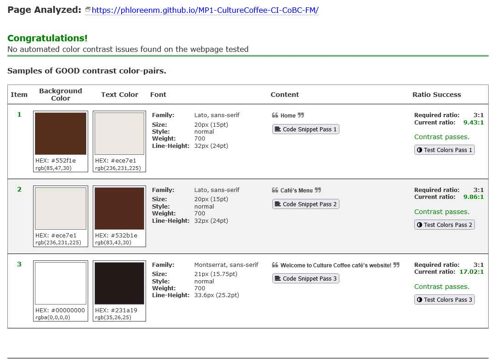
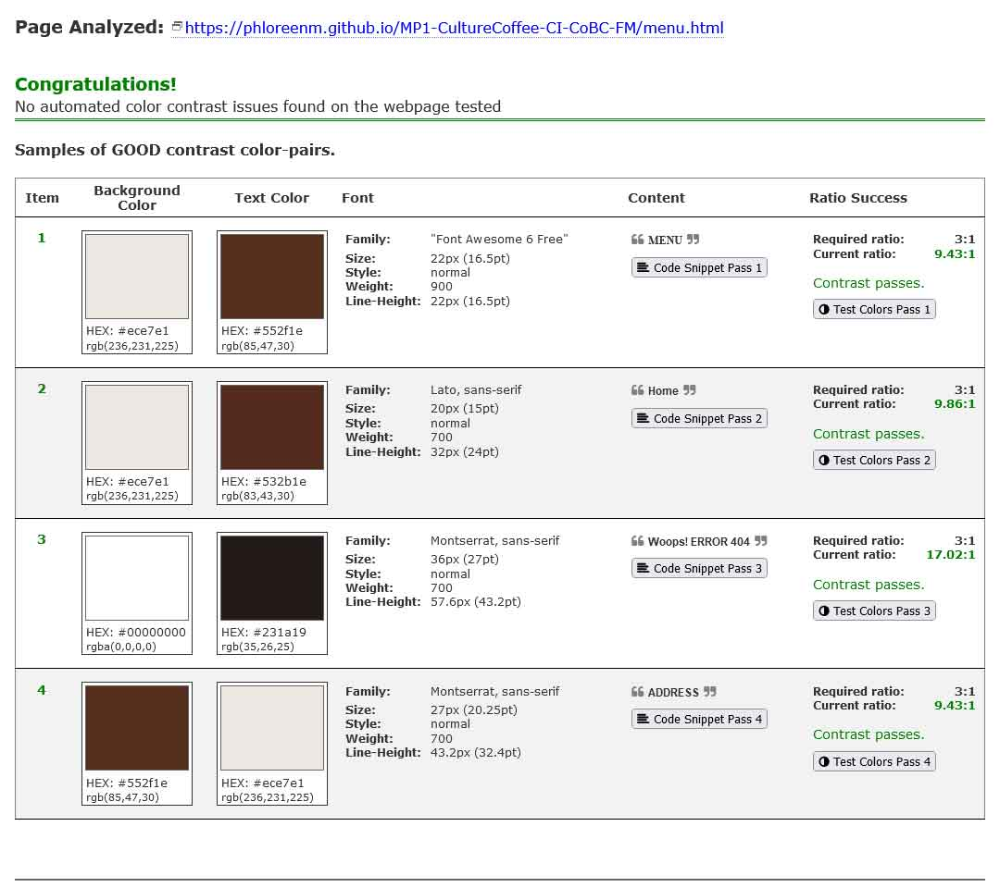
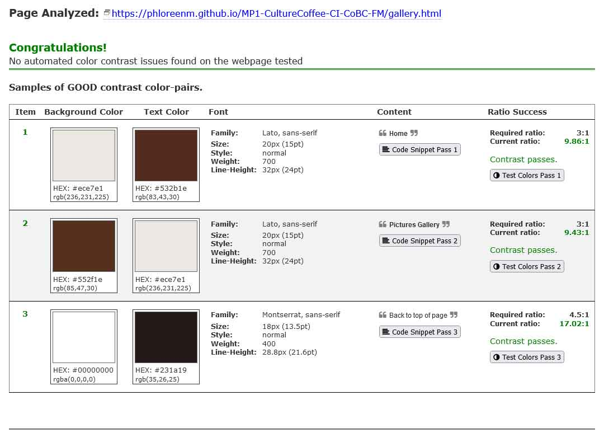
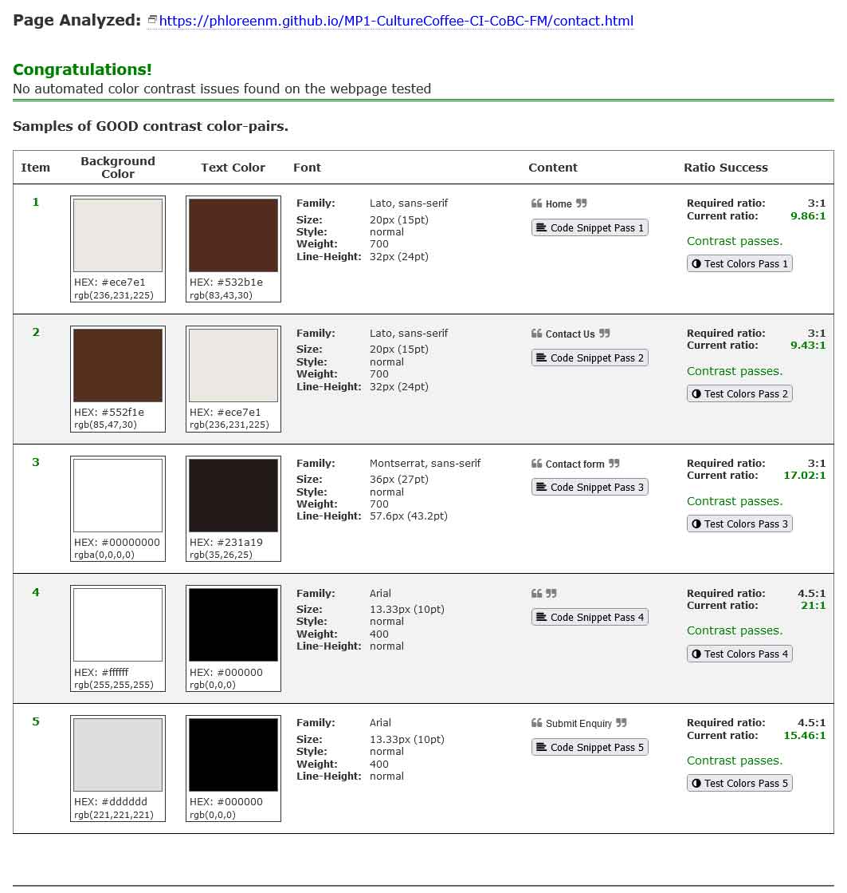
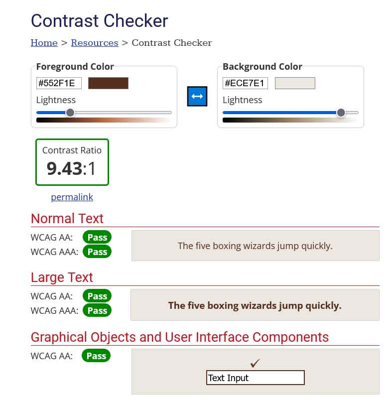
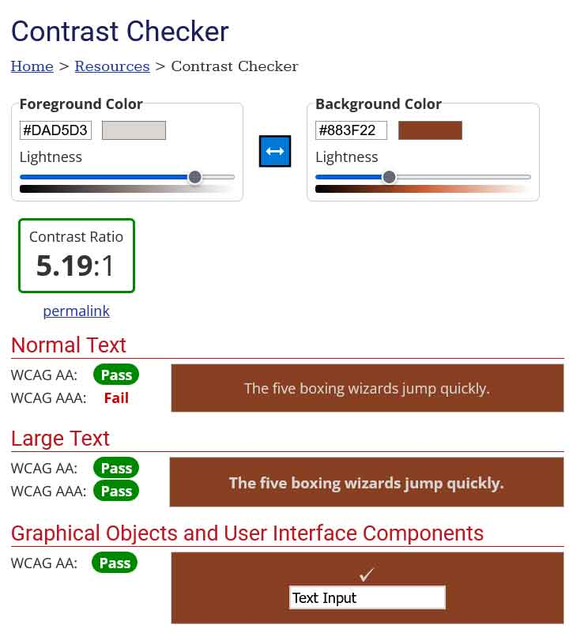
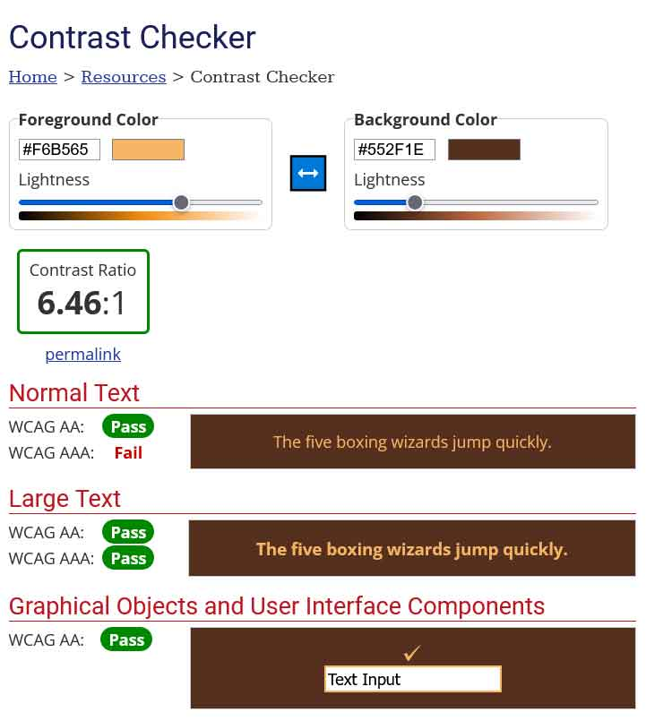

Back to MAIN [README.md](../../README.md)

    

---

# **Contrast testing**

1. [**Home Page results**](#home-page)
1. [**Menu Page results**](#menu-page)
1. [**Gallery Page results**](#gallery-page)
1. [**Contact Page results**](#contact-page)
1. [**WebAIM check**](#webaim-check)
1. [**Conclusion**](#conclusion)

---

# **Home Page**

 

    <a href="#contrast-testing">Return to Table of Contents</a>

 

# **Menu Page**

 

    <a href="#contrast-testing">Return to Table of Contents</a>

 

# **Gallery Page**

 

    <a href="#contrast-testing">Return to Table of Contents</a>

 

# **Contact Page**

 

    <a href="#contrast-testing">Return to Table of Contents</a>

 

# **WebAIM check**

The active menu item in the header:

The links in the footer while hovering:

---

# **Conclusion**
The automated services could not determine the contrast ratio for the elements which change their text color while hovering, so I conducted manual tests for the links in the navigation menu and the footer area. 
While the general contrast ratio is over 9:1 for most of the site content, for the links in the navigation menu (specifically the active element) and in the footer, while hovering, were both over a ratio of 5:1.

These result conclude that the contrast ratio is over the 3:1 minimum required ratio.

---

 

    <a href="#contrast-testing">Return to Table of Contents</a>

 

[Back to README.md](../../README.md)