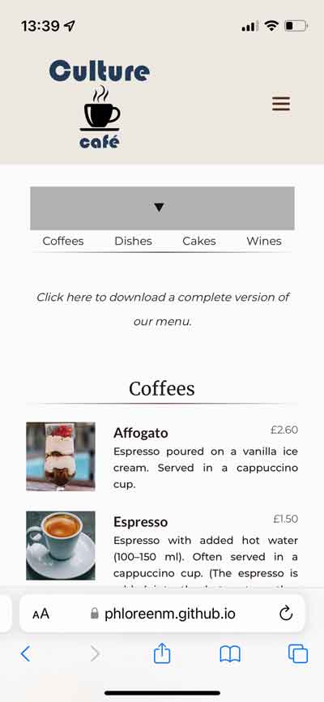

[Back to MAIN README.md](../../README.md)

    

# **TESTING**

## Testing Page Table of Contents
* [**Development Testing**](#during-development-testing)
    * [*Manual Testing*](#manual-testing)
    * [*Bugs and Fixes*](#bugs-and-fixes)
* [**Release Testing**](#release-testing)
  * [**Validators**](#validation-testing)
      * [*HTML*](#http-validation)
      * [*CSS*](#css-validation)
  * [**Lighthouse Scores**](#lighthouse-scores)
      * [*Mobile Version*](#lighthouse-mobile-testing)
      * [*Desktop Version:*](#lighthouse-desktop-testing)
      
  * [**Conclusions**](#conclusions)
  * [**Issues and Bugs**](#issues-and-bugs)

## **During Development Testing**
While developing the website I've tested its functionality locally (Live Server in VS Code or through `python3 -m http.server command`), but also the deployed page on GitHub Pages.

1. I've conducted manual testing for each element for appearance and responsiveness via a simulated live server using an extension in VSCode.
    
1. The webpage was deployed on GitHub Pages and I've asked few friends to check the page as a normal user and then send me a feedback.

### ***Manual Testing:***
* During testing, I've used different browsers to ensure cross-compatibility. The desktop browsers used by myself were:
#### Mobile Devices Browsers (Smartphone and Tablet):
- Chrome
- Firefox  
- Opera
- Brave
- Edge
- Safari
#### Desktop Browsers:
- Chrome
- Firefox 
- Brave 
- Opera
- Edge
- Safari
#### Testings done on these devices:
- Smartphones
  - Samsung Galaxy S7 (5.1 inches / 1440 x 2560)
  - iPhone 13 mini (5.4 inches / 1080 x 2340)
  - Samsung Galaxy S21 Ultra (6.8 inches / 1440 x 3200)
- Tablet:
  - Samsung Galaxy Tab S4 LTE (10.5 inches / 1600 x 2560)
- Laptops:
  - Dell 5290 (12.50 inches / 1366 x 768)
  - Dell 7490 (14.0 inches /	1920 x 1080)
  - Dell 7390 2 in 1 (13.3 inches /	1920 x 1080)
  - Apple MacBook Air M1 (13.3 inches / 2560 x 1600)
- Desktop monitors:
  - Lenovo ThinkVision T27p-10 27" UHD (27.0 inches / 3840 x 2160)
  - ASUS ProArt Display PA247CV 23.8 (23.8 inches / 1920 x 1080)
  - MSI Optix MAG162V (15.6 inches / 1920 x 1080)
* I also used the Device Toolbar from DevTools to simulate different devices with different widths, ranging from 300px to over 2000px.
* At the end of this file, in the [**Issues and Bugs**](#issues-and-bugs) section, I've noted down some issues I encountered along these tests.
 

    <a href="#testing">Return to testing.md Table of Contents</a>

 

## **Release Testing**
### **Validation Testing**
- For HTML validator I've used the [Nu Html Checker](https://validator.w3.org/nu/). I've tested the pages one by one by using the link of the deployed website and by text input. The later was faster, because the deployed page on GitHub Pages is taking longer to refresh.
-  For CSS validation I've used [The W3C CSS Validation Service](https://jigsaw.w3.org/). The `style.css` file is used for all the pages, but I've tested all pages individualy, just to make sure everything goes right.
- HTML validator Results:

      <strong>index.html</strong> final validation results: 
        

      <strong>cafesmenu.html</strong> final HTML validation results: 
        

      <strong>gallery.html</strong> final HTML validation results: 
        

      <strong>gallery.html</strong> final HTML validation results: 
        

      <strong>formconfirmation.html</strong> final HTML validation results: 
        

 

    <a href="#testing">Return to testing.md Table of Contents</a>

 

- CSS validator results:

      <strong>index.html</strong> final CSS validation results: 
        

      <strong>cafesmenu.html</strong> final CSS validation results: 
        

      <strong>gallery.html</strong> final CSS validation results: 
        

      <strong>contact.html</strong> final CSS validation results: 
        

      <strong>formconfirmation.html</strong> final CSS validation results: 
        

 

    <a href="#testing">Return to testing.md Table of Contents</a>

 

---
## **Lighthouse Scores**
### **Lighthouse Mobile Testing**
  - I part:
    
  - II part:
    
### **Lighthouse Desktop Testing**
  - I part:
    
  - II part:
    

 

    <a href="#testing">Return to testing.md Table of Contents</a>

 

---

## **Conclusions**
- Performance score was affected by the external libraries I've used (Google Fonts, FontAwesome), but disabling them wasn't an option.
- Also, while testing, the performance can be infleunced by the __extensions__ the browser has installed and by the internet speed.
- CEO lower score across all pages ofthe website was caused by an anchor linking to an internal link.
  
  The suggested solution was to use `pre-connect` resource 'to estabilish early connection to thirst-party origins':
  
- Below the SEO section there is a 'Mobile Friendly' recommandation, which suggests `Tap targets are not sized appropriately`, so I've tested all the links, especially the ones in the footer area, and testing them on smartphone devices looked and felt perfectly normal. The text is readable and the links are sized enought to be clickable.
  

 

    <a href="#testing">Return to testing.md Table of Contents</a>

 

---

## **Issues and Bugs**
- On iPhone 13 mini using Safari browser :
  - On **Café's Menu** page the internal links area (used details and summary elements) is not displayed correctly:
    

      Quick links menu heading not displayed: 
        
        
    

    - This issue doesn't appear on MacBook Safari version, only on the mobile version.
    - But on Samsung Galaxy S7 on Chrome (and other browsers tested) is displayed correctly:
      

        
      

    - Searching online to solve this issue, I've' found out that there is a wide issue with Safari compatibility when using and styling the details element. A better solution would've been to avoid using this element.
  - On **Contact** page, at the bottom, the `input type="submit"` and `input type="reset"` are displayed with very rounded corners, compared to any other device:
        

          iPhone 13 mini on any browser: 
        
    

    

    Samsung Galaxy S7 and any other devices on any browser:  
      
    

- On a smartphone in landscape display mode, the menu was not scrollable and displayed partially:
    

    Menu overflowing: 
        
    

  Been fixed by adjusting the sizes of the menu elements: no margin, but larger font-size:
    

    Menu displaying correctly: 
        
    

  --- 

 

    <a href="#testing">Return to Testing.md Table of Contents</a>

 

---

[Back to MAIN README.md](../../README.md)