[Back to MAIN README.md](../../README.md)

    

# **WIREFRAMES**
- **Landing Page**
    - [**Mobile view**](#landing-page-mobile-view)
    - [**Tablet view**](#landing-page-tablet-view)
    - [**Desktop view**](#landing-page-desktop-view)
- **Cafe's Menu Page**
    - [**Mobile view**](#cafesmenu--mobile-view)
    - [**Tablet view**](#cafesmenu--tablet-view)
    - [**Desktop view**](#cafesmenu--desktop-view)
- **Gallery Page**
    - [**Mobile view**](#gallery--mobile-view)
    - [**Tablet view**](#gallery--tablet-view)
    - [**Desktop view**](#gallery--desktop-view)
- **Contact Us Page**
    - [**Mobile view**](#contact-us-mobile-view)
    - [**Tablet view**](#contact-us-tablet-view)
    - [**Desktop view**](#contact-us-desktop-view)
## [Balsamiq all pages wireframes export image link](../readme-images/wireframes/cc-mp1-wireframes-export.png)

---

Site's wireframes were made using Balsamiq app.
Since the very first mock-up design I've made, I had to redraw the wireframes two times more. I found better ways of building the layout and also better looking elements positioning acrros the page.
These are the latest Wireframes, on which site's layout was built.

---
## **Landing Page Wireframes**
### **Landing Page Mobile View**

    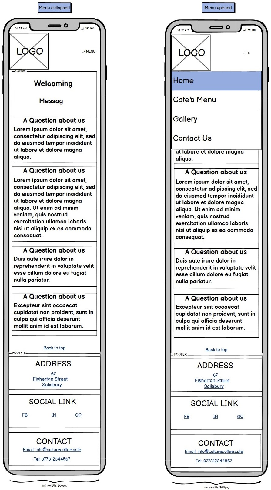

### **Landing Page Tablet View**

    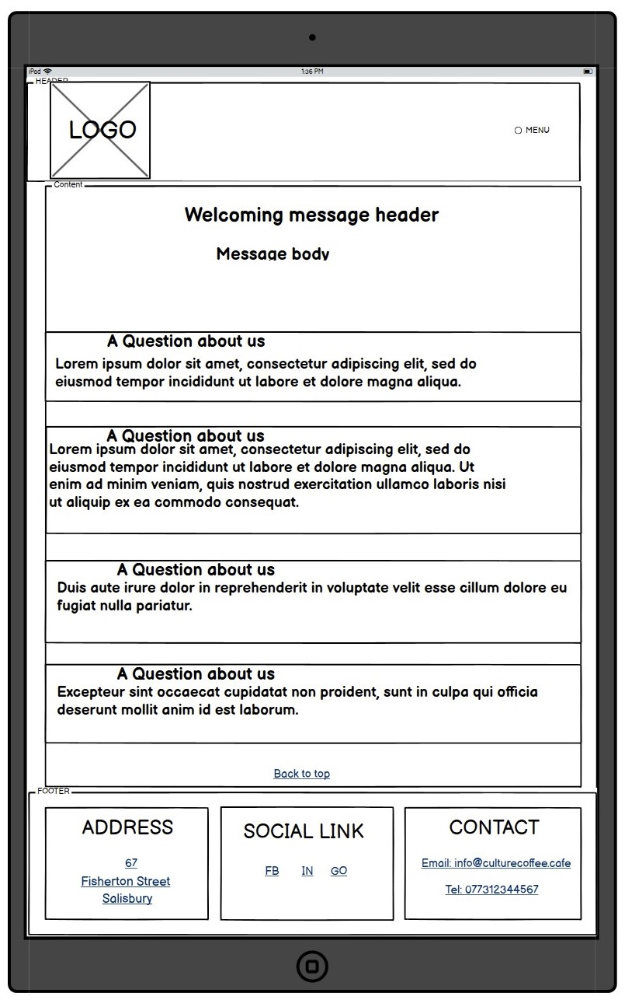

### **Landing Page Desktop View**

    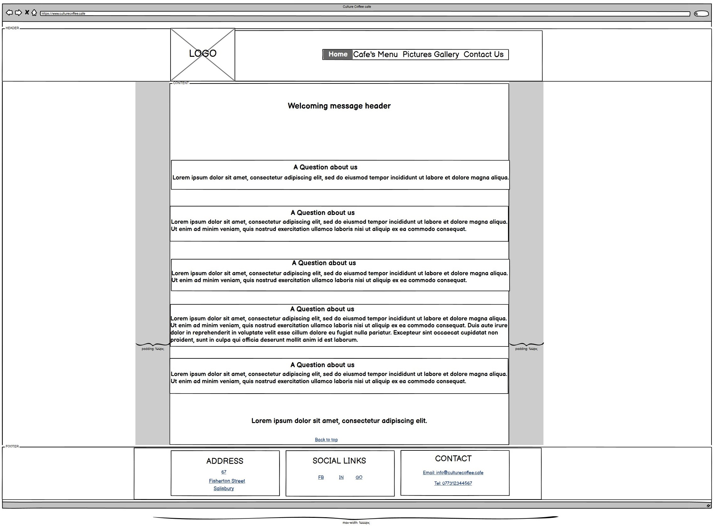

 

    <a href="#wireframes">Return to Wireframes Table of Contents</a>

 

---

## **Cafe's Menu Page Wireframes**
### **Cafe's Menu Mobile View**

    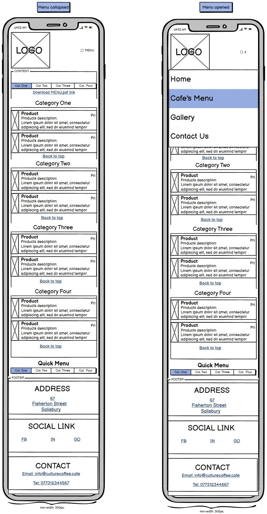

### **Cafe's Menu Tablet View**

    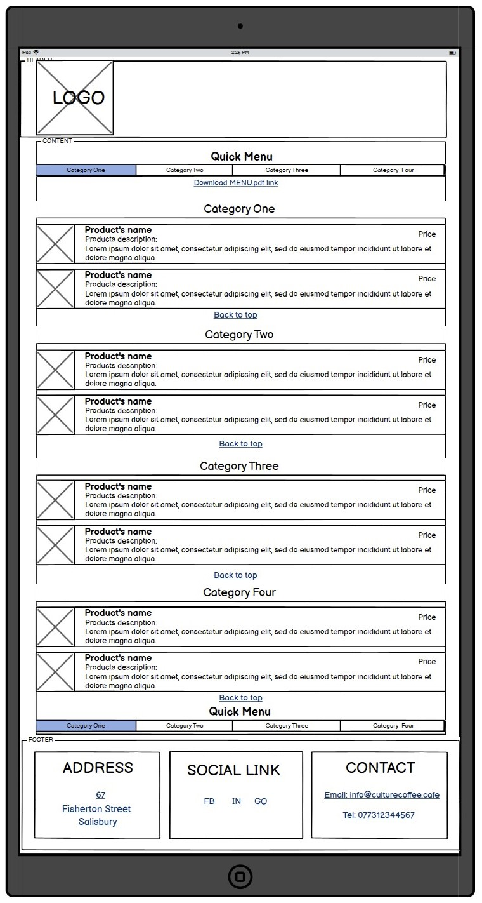

### **Cafe's Menu Desktop View**

    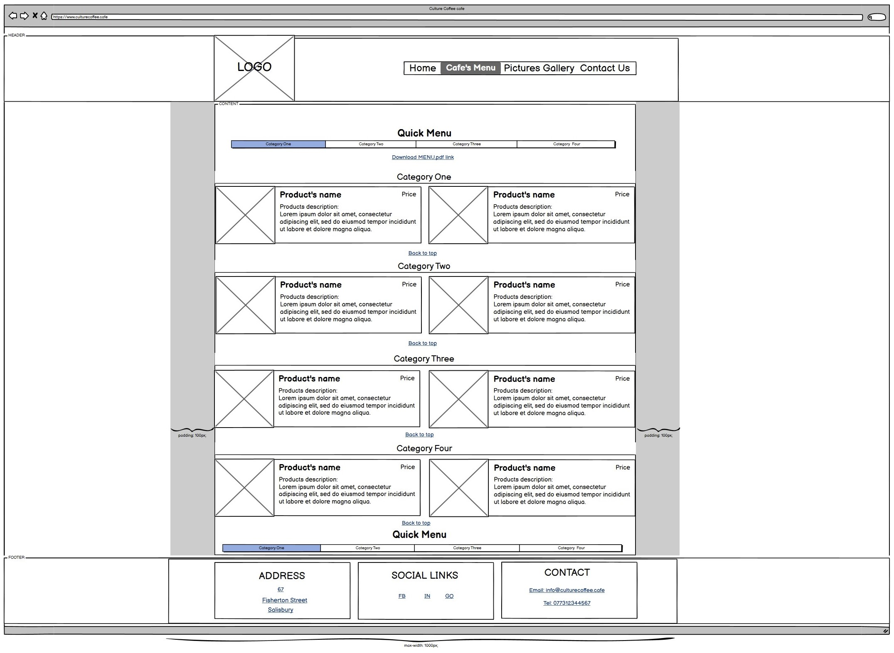

 

    <a href="#wireframes">Return to Wireframes Table of Contents</a>

 

---

## **Gallery Page Wireframes**
### **Gallery Mobile View**

    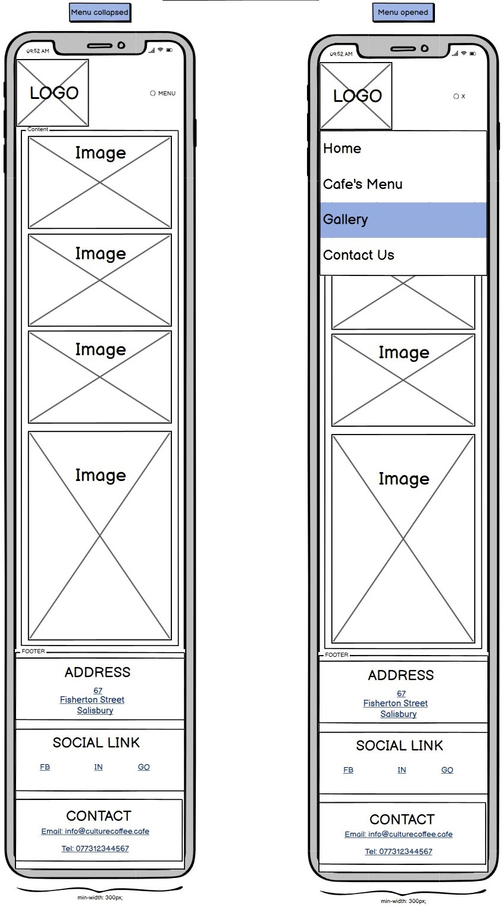

### **Gallery Tablet View**

    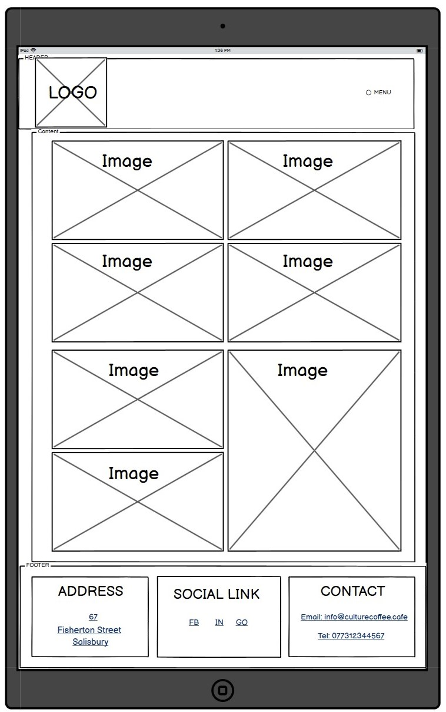

### **Gallery Desktop View**

    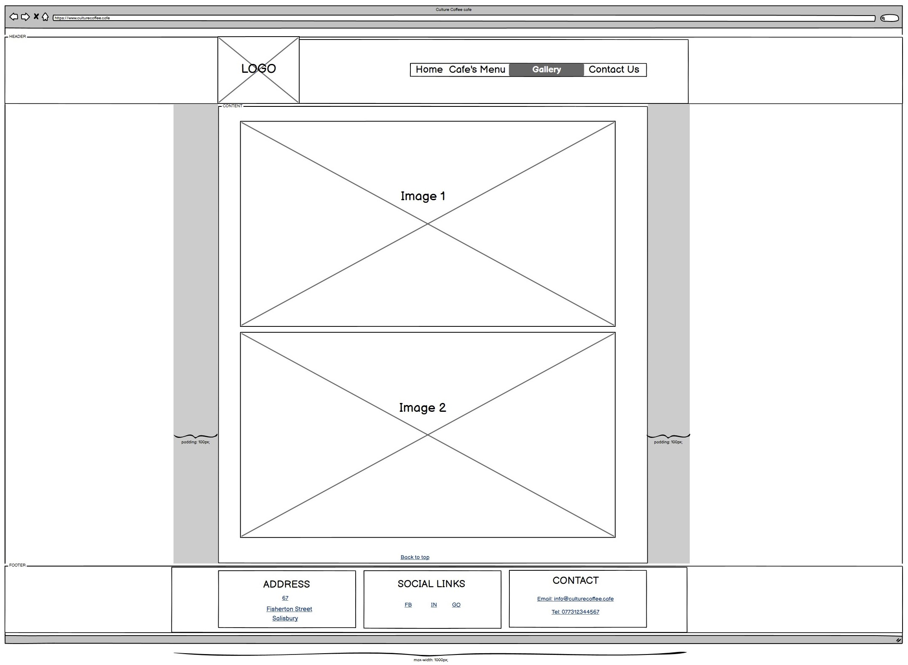

 

    <a href="#wireframes">Return to Wireframes Table of Contents</a>

 

---

## **Contact Us Page Wireframes**
### **Contact Us Mobile View**

    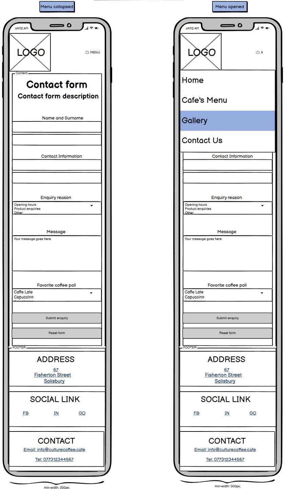

### **Contact Us Tablet View**

    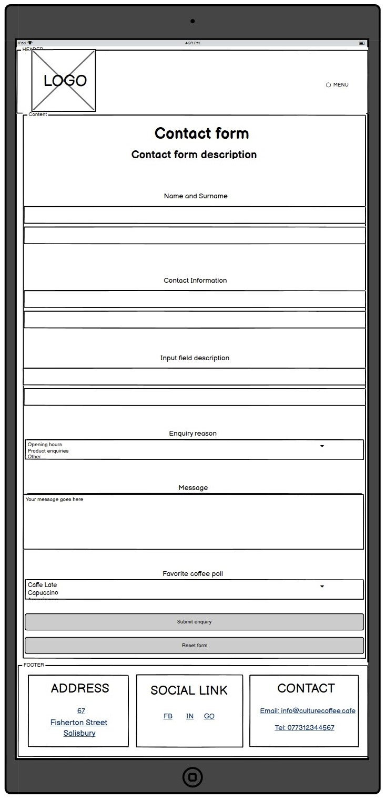

### **Contact Us Desktop View**

    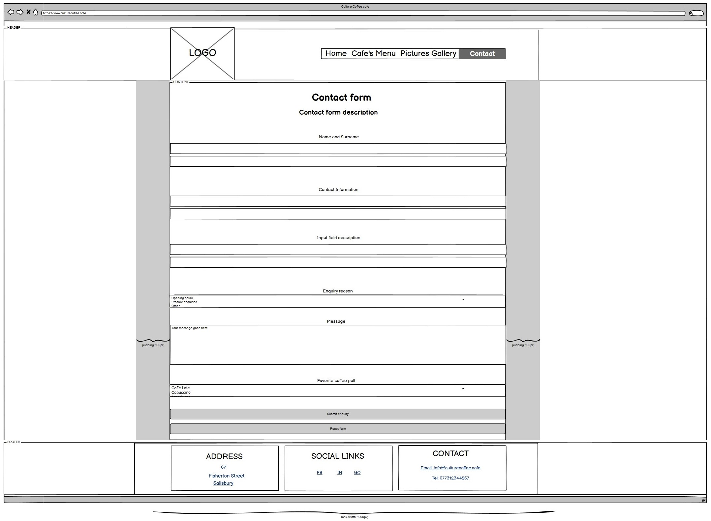

---

 

    <a href="#wireframes">Return to Wireframes.md Table of Contents</a>

 

---

[Back to MAIN README.md](../../README.md)
