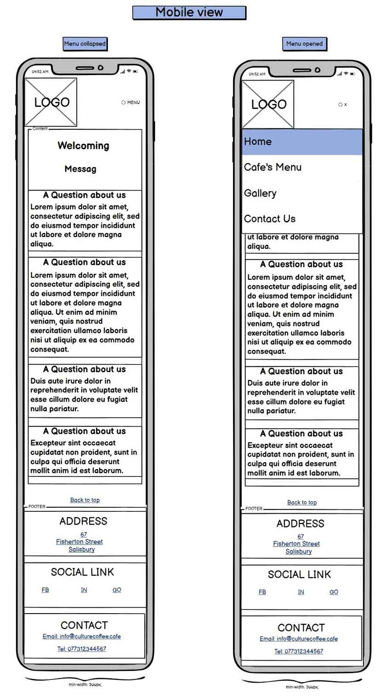
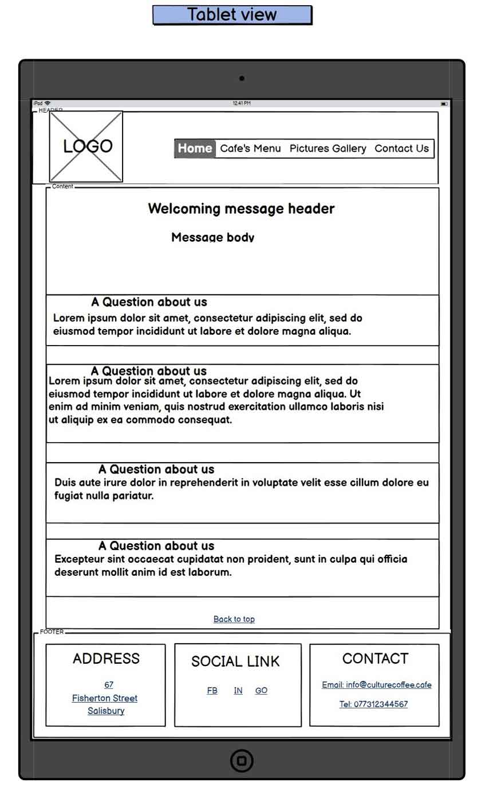

[Back to MAIN README.md](../../README.md)

    

# **WIREFRAMES**
## [**Mobile view**](#mobile-view)
## [**Tablet view**](#tablet-view)
## [**Desktop view**](#desktop-view)

---

Site's wireframes were made using Balsamiq app.
Since the very first mock-up design I've made, I had to adapt to layout two times more. I found better ways of building the layout and also better looking elements positioning acrros the page.

The layout of the page keeps a simple structure across the devices. For this reason

---

## **Mobile View**

    

## **Tablet View**

    

## **Desktop View**

    

---

[Top of the page](#wireframes)

[Back to MAIN README.md](../../README.md)
