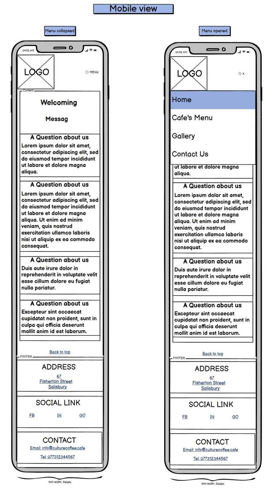
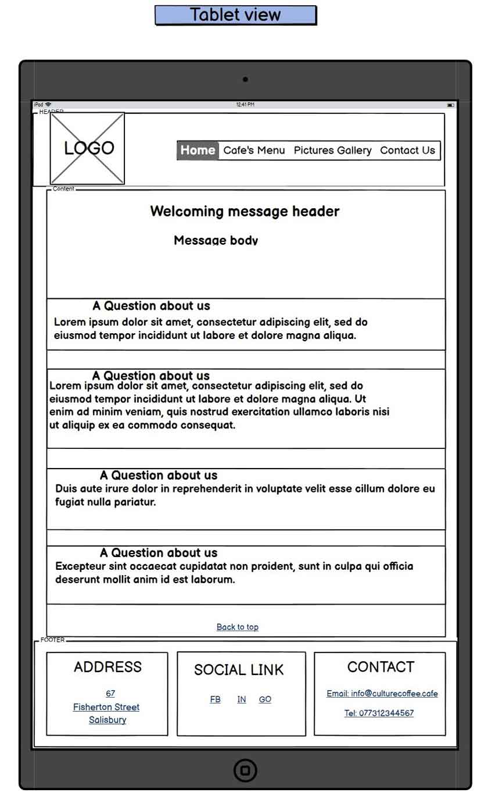
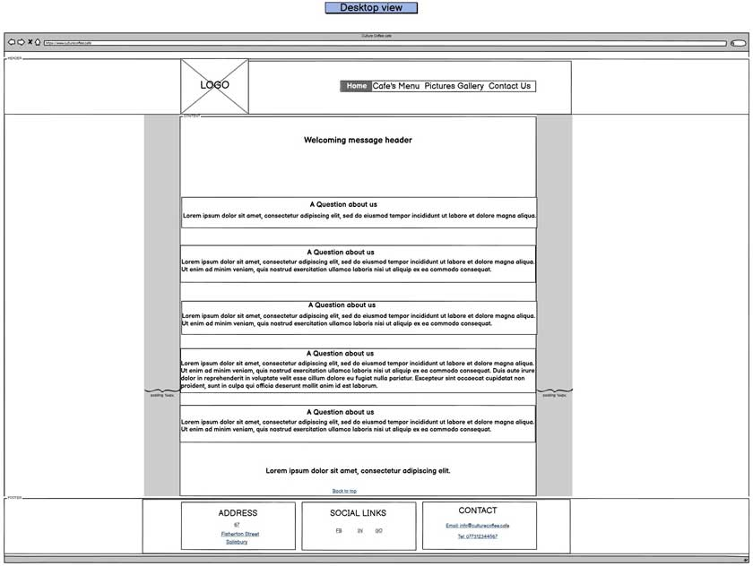

[Back to MAIN README.md](../../README.md)

    

# **WIREFRAMES**
- [**Landing Page**](#landing-page)
    - [**Mobile view**](#landing-page-mobile-view)
    - [**Tablet view**](#landing-page-tablet-view)
    - [**Desktop view**](#landing-page-desktop-view)
- [**Cafe's Menu Page**](#cafesmenu-page)
    - [**Mobile view**](#cafesmenu--mobile-view)
    - [**Tablet view**](#cafesmenu--tablet-view)
    - [**Desktop view**](#cafesmenu--desktop-view)
- [**Gallery Page**](#gallery-page)
    - [**Mobile view**](#gallery--mobile-view)
    - [**Tablet view**](#gallery--tablet-view)
    - [**Desktop view**](#gallery--desktop-view)
- [**Contact Us Page**](#contact-us-page)
    - [**Mobile view**](#contact-us-mobile-view)
    - [**Tablet view**](#contact-us-tablet-view)
    - [**Desktop view**](#contact-us-desktop-view)
## [Balsamiq all pages wireframes export image link](../readme-images/wireframes/cc-mp1-wireframes-export.png)

---

Site's wireframes were made using Balsamiq app.
Since the very first mock-up design I've made, I had to adapt to layout two times more. I found better ways of building the layout and also better looking elements positioning acrros the page.

The layout of the page keeps a simple structure across the devices. 

---
## **Landing Page Wireframes**
### **Mobile View**

    

### **Tablet View**

    

### **Desktop View**

    

[Back to Wireframes Table of Contents](#wireframes)

---

## **Cafe's Menu Page Wireframes**
### **Mobile View**

    

### **Tablet View**

    

### **Desktop View**

    

[Back to Wireframes Table of Contents](#wireframes)

---

## **Gallery Page Wireframes**
### **Mobile View**

    

### **Tablet View**

    

### **Desktop View**

    

[Back to Wireframes Table of Contents](#wireframes)

---

## **Contact Us Page Wireframes**
### **Mobile View**

    

### **Tablet View**

    

### **Desktop View**

    

[Back to Wireframes Table of Contents](#wireframes)

---

[Top of the page](#wireframes)

[Back to MAIN README.md](../../README.md)
